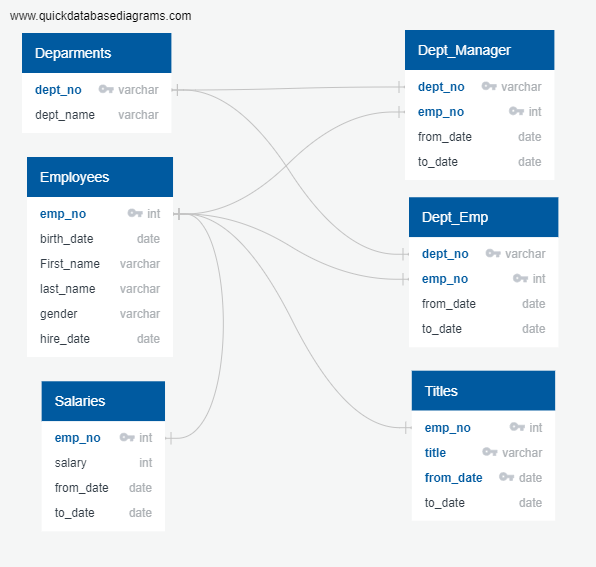
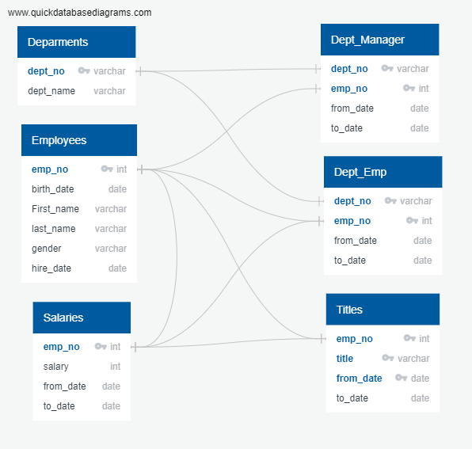

# Pewlett-Hackard-Analysis

## Project Overview

Analyze Pewlett Hackard employee database using PostgreSQL to help the company anticipate the "silver tsunami" as many current employees will leave to retirement.
For this analysis we will:

1. Determine the number of retiring employees per title,
2. Identify employees who are eligible to participate in a mentorship program.

## Resources

- Orginal datasets:

-- departments.csv
-- dept_emp.csv
-- dept_manager.csv
-- employees.csv
-- salaries.csv
-- titles.csv

- Software:

-- SQL
-- PostgreSQL
-- pgAdmin

## Results

- A total of 90,398 employees are about to retire from the company. This represents 30% of the company's total 300,024 employees.

-- This is a staggering number of employees who will be retiring soon and definitely confirms that HR needs to put into action immediate strategy to prepare for their replacement.
-- This data can be found by viewing the "unique_titles" table in the database or in the exported csv "unique_titles.csv".

- The majority of the staff ready to retire are Senior Engineers (33% of total retiring), and Senior Staff (32% of total retiring).

-- This outcome will leave quite a gap in the technical department and high level skill. These positions are also ones that require a higher portion of training, development, and skill. The company indeed has a challenge ahead.
-- This data can be found by viewing the "retiring_titles" table in the database or in the exported csv "retiring_titles.csv"

- The least amount of employees who need replacing include Assistant Engineers and Managers.
-- Hopefully this smaller number for Assistant Engineers will provide the company with some wiggle room to quickly train up the Assistant Engineers to become promoted to Senior Engineers.

- There are 1,549 employees eligible for the mentorship program to act as mentees. In comparison to the total number of employees eligible to retire, this is not a very high percentage. Less than 2% in fact. These are current employees whose birth dates are between January 1, 1965 and December 31, 1965. This means they are exactly ten years younger than the current youngest who plan to retire soon.

-- However, this is still better than nothing, and at least still a plan to move forward in some level of replacement planning.
-- If Pewlett Hackard decides to expand the mentorship program by increasing the age rage to
-- This data can be found by viewing the "mentorship_eligibility" table in the database or in the exported csv "mentorship_eligibilitys.csv"

#### EmployeeDB Original

#### EmployeeDB Updated

## Summary

### High Level Overview

- How many roles will need to be filled as the "silver tsunami" begins to make an impact?:

-- According to the database, 90,398 roles will have to be filled in the next few years.
-- The HR department should intially focus on Senior Enginner and Senior Staff roles as 29,414 and 28,254 positions will need to be filled.

- Are there enough qualified, retirement-ready employees in the departments to mentor the next generation of Pewlett Hackard employees?

-- There are more people retiring than there are potential mentors, which means that the company would have to create an efficient program that can cover the disparity between the number of people retiring and the number of people who can be trained to fill these positions. However, there are only 1,549 eligible employees to participate in the actual mentorship program as mentees and for this reason, there actually are enough mentors to mentor through only the mentorship program.
